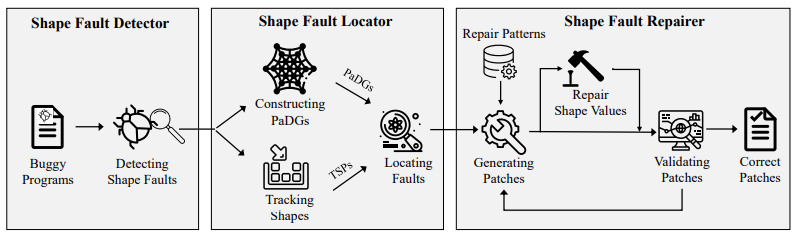

# Tensfa2
An approach to detecting and repairing crashing tensor shape faults, which expands Tensfa.

## Introduction

Software developers frequently invoke deep learning (DL) APIs to incorporate learning solutions into software systems. However, misuses of these APIs can cause various DL faults, such as tensor shape faults. Tensor shape faults occur when restriction conditions of operations are not met; they are prevalent in practice, leading to many system crashes.

Meanwhile, researchers and engineers still face a strong challenge in detecting tensor shape faults --- static techniques incur heavy overheads in defining detection rules, and the only dynamic technique requires human engineers to rewrite APIs for tracking shape changes. 

To address the above challenge, we conduct a deep empirical study on crashing tensor shape faults (i.e., those causing programs to crash), categorizing them into four types and revealing twelve repair patterns.

We then propose and implement Tensfa2, an approach to detecting and repairing crashing tensor shape faults. 

The following figure presents an overview of Tensfa2.
* Tensfa2 takes a machine learning method to learn from crash messages and employs decision trees in detecting tensor shape faults. Detection code is available in the directory [detect](./detect).
* Tensfa2 also provides the first automated solution to repairing the detected faults: it tracks shape properties by a customized Python debugger, analyzes their data dependences, and uses the twelve patterns to generate patches. Localization and repair code is available in the directory [locate_repair](./locate_repair).
* We propose a search-based method to repair shape value faults, named SVR. Through an analysis on past fixes, we find that ten of the twelve repair patterns can fail in providing patches with correct shape values, and the search space of the correct shapes is constrained by the shapes that have semantic relationships with them (Section 3.4). Based on this finding, we initialize shape
search space with PaDG, expand the search space by shape operations, and then heuristically search for correct shape values (Section 4.4.2). The result shows that with SVR, the performance of Tensfa2 is improved from 54.79% to 56.16% (Section 5.4).
* We design three ranking strategies to prioritize the repair patterns. We conduct a further analysis on the frequencies and time costs of 12 repair patterns (Section 3.3). These strategies are utilized to rank the candidate patterns to improve the efficiency of repairing tensor shape faults (Section 4.4.1). The result shows that a d-frequency/duration ranking strategy assists Tensfa2 to achieve the optimal time efficiency (Section 5.5).

## Dataset

We construct SFData, a set of 146 buggy programs with crashing tensor shape faults, by taking the following steps:
1. collecting shape-fault-related posts in StackOverflow
2. analyzing these faults and further associating them with other supplementary information (e.g., crash messages, source code, patches and test data).
SFData is available in the directory [SFData](./SFData).

## Results
Our Tensfa2 has been implemented and evaluated on SFData and IslamData (another dataset of tensor shape faults). The results clearly show the effectiveness of Tensfa2. In particular, Tensfa2 achieves the state-of-the-art results: it reaches an F1-score of 96.88% in detecting the faults and repairs 82 out of 146 buggy programs in SFData.
The experimental results are available in the directory [results](./results).